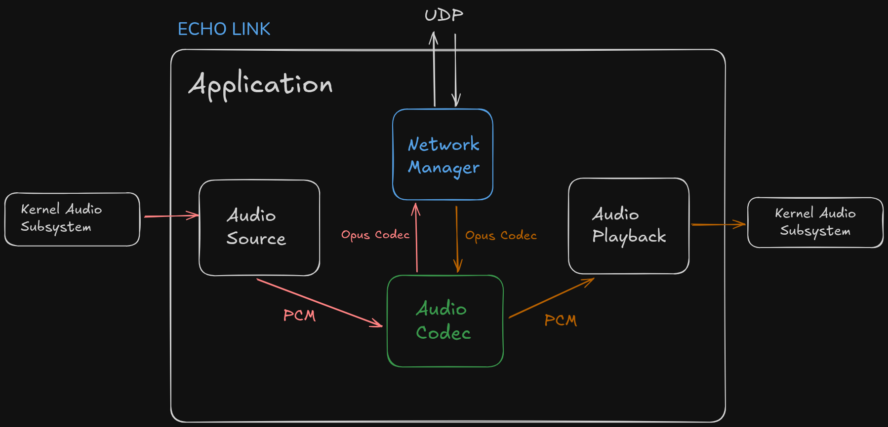

echo-link/README.md
# Echo-Link



## Overview

**Echo-Link** is a real-time audio streaming application designed to capture audio from a system's input device (e.g., microphone), encode it, transmit it over a network, decode it on the receiving end, and play it back through the system's output device (e.g., speakers). The project leverages modern C++ features, PortAudio for cross-platform audio I/O, Opus for high-quality audio compression, and ASIO for efficient networking.

---

## High-Level Architecture

The diagram above illustrates the main components and data flow in Echo-Link:

1. **Audio Capture**
   - `PortAudioCapture` interfaces with the OS audio subsystem (ALSA, Core Audio, WASAPI, etc.) via PortAudio.
   - Captures raw PCM audio frames from the hardware audio input buffer (microphone).
   - Frames are pushed into a thread-safe queue.

2. **Audio Encoding**
   - `AudioCodec` encodes PCM frames into compressed Opus packets for efficient network transmission.

3. **Network Transmission**
   - `NetworkManager` handles UDP-based asynchronous sending and receiving of audio packets using ASIO.
   - Outgoing packets are sent to the remote peer; incoming packets are received and queued for decoding.

4. **Audio Decoding**
   - `AudioCodec` decodes received Opus packets back into PCM frames.

5. **Audio Playback**
   - `PortAudioPlayback` pulls decoded PCM frames from a queue and writes them to the hardware audio output buffer (speakers/headphones) via PortAudio.

6. **ThreadSafeQueue**
   - Generic, thread-safe queues are used throughout to safely pass audio frames and network packets between threads and modules.

---

## Main Classes and Responsibilities

| Class/Interface         | Description                                                                                  |
|------------------------|----------------------------------------------------------------------------------------------|
| `Application`          | Central orchestrator. Manages modules, queues, and threads for encoding, decoding, and I/O.  |
| `IAudioSource`         | Abstract interface for audio sources (capture).                                              |
| `PortAudioCapture`     | Captures audio from the system input device using PortAudio.                                 |
| `FakeAudioSource`      | Simulates an audio source by reading from a file (for testing).                             |
| `IAudioPlayback`       | Abstract interface for audio playback devices.                                               |
| `PortAudioPlayback`    | Plays audio to the system output device using PortAudio.                                     |
| `AudioCodec`           | Encodes/decodes audio frames using the Opus codec.                                           |
| `NetworkManager`       | Handles UDP networking using ASIO.                                                           |
| `ThreadSafeQueue<T>`   | Thread-safe queue for passing data between modules/threads.                                  |

---

## Audio Data Flow

1. **Capture:**
   Audio is captured from the system's hardware audio input buffer via `PortAudioCapture`.

2. **Encode:**
   Captured PCM frames are encoded to Opus packets by `AudioCodec`.

3. **Transmit:**
   Encoded packets are sent over the network by `NetworkManager`.

4. **Receive:**
   Incoming packets are received by `NetworkManager` and queued for decoding.

5. **Decode:**
   Received Opus packets are decoded back to PCM frames by `AudioCodec`.

6. **Playback:**
   Decoded PCM frames are played back through the system's hardware audio output buffer via `PortAudioPlayback`.

---

## Building and Running

### Prerequisites

- C++17 or newer compiler
- [PortAudio](http://www.portaudio.com/) (development headers and libraries)
- [Opus](https://opus-codec.org/) (development headers and libraries)
- [ASIO](https://think-async.com/Asio/) (standalone or Boost)
- CMake (recommended for building)

### Build Instructions

```bash
mkdir build
cd build
cmake ..
make
```

### Running

After building, run the application binary. You may need to specify configuration parameters (e.g., input/output device, network peer address) depending on your setup.

---

## Extending Echo-Link

- **Custom Audio Sources:** Implement the `IAudioSource` interface for new capture methods.
- **Custom Playback Devices:** Implement the `IAudioPlayback` interface for new playback methods.
- **Alternative Codecs:** Extend or replace `AudioCodec` for different audio codecs.
---
